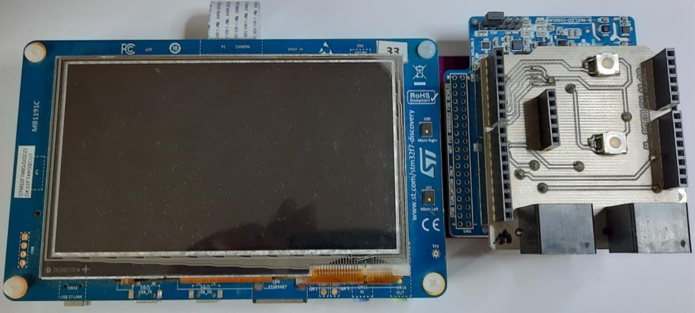
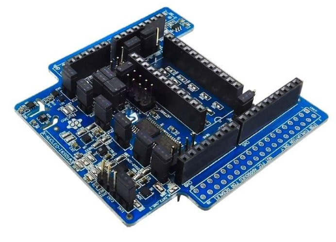

# 🌦️ Embedded Weather Station Based on STM32F746G-Discovery
## 📌 Project Overview

This project is a fully embedded weather monitoring system developed using the STM32F746G-DISCOVERY board and X-NUCLEO-IKS01A3.

The system acquires real-time environmental data from multiple sensors on X-NUCLEO-IKS01A3, processes the measurements using STM32 peripherals, and displays them on an interactive touchscreen interface.

This project highlights competencies in:

- Embedded firmware development

- Sensor interfacing (I2C, ADC, GPIO interrupts)

- Real-time data acquisition

- GUI design for embedded systems

---

## 🎯 Objectives

- Monitor local atmospheric conditions in real time
- Sensor interfacing (I2C, ADC, GPIO)
- Touchscreen graphical interface
- Modular embedded firmware architecture
- Implement energy-efficient screen management

---

## 🧠 System Architecture
### 🔧 Main Board
- STM32F746G-DISCOVERY
  - MCU: STM32F746NGH6 (ARM Cortex-M7 @ 216 MHz)
  - 4.3” TFT LCD (480x272)
  - Capacitive touch panel
  - Integrated microSD support
### 🌡️ Environmental Sensors

| Measurement              | Sensor                    | Interface        |
|--------------------------|---------------------------|------------------|
| Temperature & Humidity   | HTS221                    | I2C              |
| Barometric Pressure      | LPS22HH                   | I2C              |
| Wind Speed               | Cup Anemometer            | GPIO Interrupt   |
| Wind Direction           | 16-position Wind Vane     | ADC              |
| Rainfall                 | Tipping Bucket Gauge      | GPIO Counter     |


<h2 align="center">Hardware Components</h2>

<p align="center">
  
  &nbsp;&nbsp;&nbsp;
  
  &nbsp;&nbsp;&nbsp;
  
</p>

<p align="center">
  <em>
  Left: STM32F746G-Discovery
  &nbsp;&nbsp; | &nbsp;&nbsp;  
  Center: X-NUCLEO-IKS01A3 Environmental Sensor
  &nbsp;&nbsp; | &nbsp;&nbsp;  
  Right: SparkFun Weather Meter Kit
  </em>
</p>

---

## 💻 Software & Technologies

- Embedded C
- STM32 HAL Drivers
- CMSIS
- I2C communication protocol
- GPIO interrupt-based pulse counting
- Timers
- ADC sampling & calibration
- RTC time stamping
- Custom touchscreen graphical interface
- Real-time graph plotting (60-seconde history buffer)

---

## 📊 Features
### 🌍 Real-Time Monitoring
- Temperature (°C)
- Humidity (%RH)
- Pressure (hPa)
- Wind speed (km/h)
- Wind direction (°)
- Rainfall (mm)

### 📈 Data Visualization
- Historical graphs (last 60 minutes)
- Trend analysis
- Touch-based navigation

### ⚡ Power Optimization
- Automatic screen sleep after inactivity
- Touch-based wake-up

---

## 🚀 Getting Started

### Requirements
- STM32CubeIDE
- ST-LINK Debugger

### Installation

```bash
git clone https://github.com/yourusername/yourrepo.git
